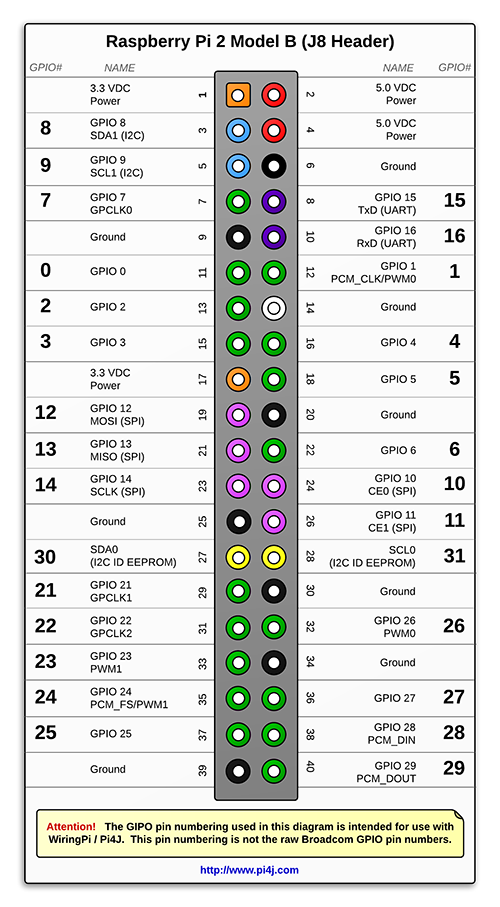

<h3>Java Controlled LED Matrix via a MAX7219 SPI Controller</h3>

<h3>Overview</h3>

<helper:RandomGreeting /> &nbsp;
This project uses Java to interface with a MAX7219 SPI device to control
an LED matrix from a Raspberry Pi.

This project is inspired by Frank Delporte's code (see the link in
the 'Resources' section below), but differs in that it is Web-enabled via
Spring Boot.

Originally, I intended for this project to be a 'weather station'.
But once I had the LED matrix Web enabled (IoT?), I realized that the
Pi4J and combination of Raspberry Pi used was not compatible with
the latest I2C API for the BMP280.  See the 'Going Further section'
for a couple details on this.

So this project just showcases the MAX7219 controlling an LED
matrix.

<h3>Demos</h3>

 
 

 
 

<h3>Hardware</h3>

<ul>
<li>
Raspberry Pi 2 Model B V1.1 -

<a href="https://pi4j.com/1.2/pins/model-2b-rev1.html" >
Pin out</a>
</li>

<li>
<a href="https://www.amazon.com/gp/product/B07VM6HXN5" >
Max7219 SPI 8x8 LED Matrix Driver</a>

</li>
</ul>

<h3>Software Prerequisites</h3>

<ul>
<li>
Pi4J version 1.2
<ul>
<li>
$ curl -sSL https://pi4j.com/install | sudo bash
</li>

<li>
<pre>
Pi4J version 3.2 was tried but SPI did not seem to work with a Model B

and gave the following error with version 3.2

UnsatisfiedLinkError = libpi4j-pigpio.so
</pre>
</li>
</ul>
</li>

<li>
Update WiringPi

<pre>
$ wget https://project-downloads.drogon.net/wiringpi-latest.deb
$ sudo dpkg -i wiringpi-latest.deb
$ gpio -v
gpio version: 2.52
gpio version: 2.52
Copyright (c) 2012-2018 Gordon Henderson
This is free software with ABSOLUTELY NO WARRANTY.
For details type: gpio -warranty

Raspberry Pi Details:
Type: Pi 2, Revision: 01, Memory: 1024MB, Maker: Embest
* Device tree is enabled.
*--> Raspberry Pi 2 Model B Rev 1.1
* This Raspberry Pi supports user-level GPIO access.

</pre>
</li>

<li>
Java 11

<pre>
sudo apt update
sudo apt upgrade
sudo apt install openjdk-11-jdk
java -version
javac -version
</pre>
</li>

<li>
Run the Application

<pre>
pi@raspberrypi:~ $ /opt/pi4j/bin/pi4j -jar pi4j-spi-1.0-SNAPSHOT-jar-with-dependencies.jar
</pre>
</li>
</ul>

<h3>Wiring and Connections</h3>

These are the connection details:

<pre>
MAX7219 LED
matrix driver -> Raspberry Pi 2 Model B v1.1

DIN -> blue   -> MOSI -> header 19

CS -> purple -> CE0  -> header 24

CLK -> white  -> SCLK -> header 23

VCC -> 5V ->  header 2

GND -> ground -> header 9

</pre>

Wiring Diagram
 

 
 

 

Image Credit:

<a href="https://pi4j.com/">
Pi4J</a>

See the
<a href="https://pi4j.com/1.2/pins/model-2b-rev1.html">
Pi4J site's</a
for more pin details.

<h3>Debugging with the Netbeans IDE</h3>

<a href="https://stackoverflow.com/a/41633184/803890">This Stackoverflow answer</a>
helped a bunch to configure debug mode in Netbeans, for this project.

Be sure to use the instructions values for Spring Boot version 2.x (again, specifically for this project/Pi B)
&nbsp;

  

Project -> Settings -> Actions -> Debug project

<pre>
Execute Goals:
spring-boot:run

Set Properties:
spring-boot.run.jvmArguments=-Xdebug -Xrunjdwp:transport=dt_socket,server=n,address=${jpda.address}
jpda.listen=true
</pre>

<h3>Run Integrations Tests</h3>

<pre>
$ mvn integration-test
</pre>

<h3>Going Further</h3>

<ul>
<li>
Add an I2C controlled

<a href="https://www.adafruit.com/product/2651">
Adafruit BMP280 Temperature Sensor
</a>

<ul>
<li>
<a href="https://pi4j.com/examples/jbang/bme280_temperature_humidity_pressure/" >
Pi4J I2C Support</a>
</li>
</ul>

</li>

<li>

</li>
</ul>

<h3>Resources</h3>

&nbsp;

<ul>
<li>
<a href="https://www.hackerspacetech.com/raspberry-pi-and-spi-8x8-led-matrix-example-with-java-and-pi4j/" >
SPI 8x8 LED Matrix Pi4J Example</a> - Frank Delporte's example
</li>

<li>
<a href="https://github.com/FDelporte/JavaOnRaspberryPi/tree/master/Chapter_09_Pi4J/java-pi4j-spi" >
Raspberry Pi and Pi4J SPI</a>
</li>

<li>

</li>
</ul>

